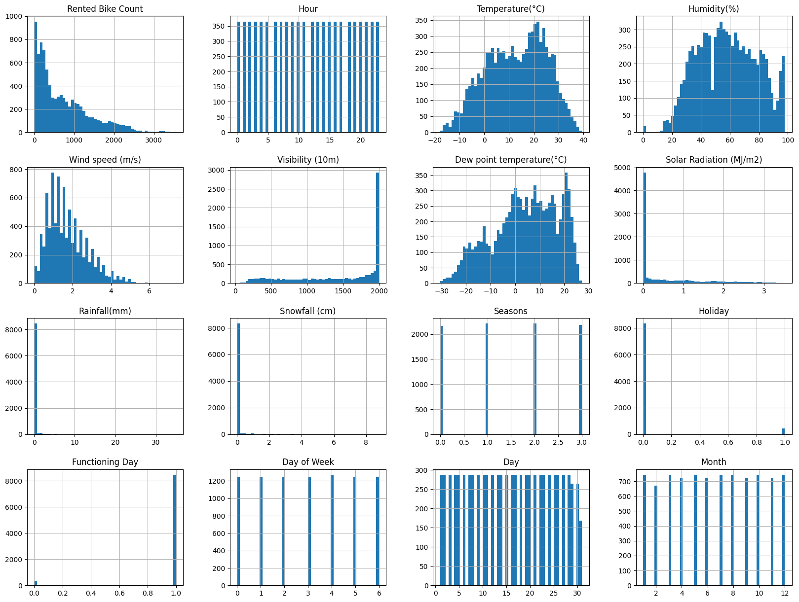
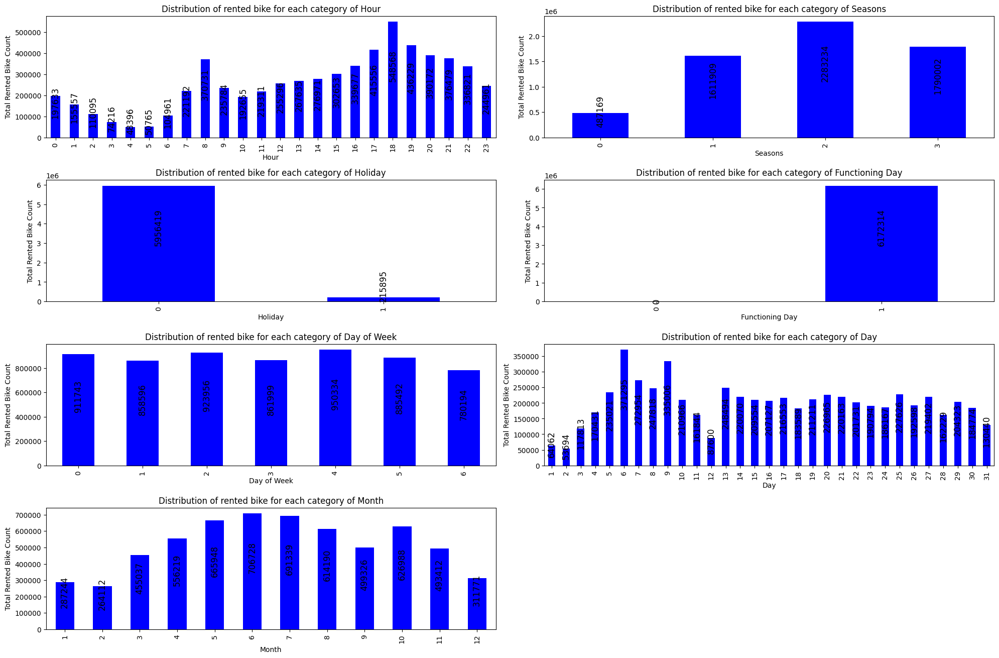
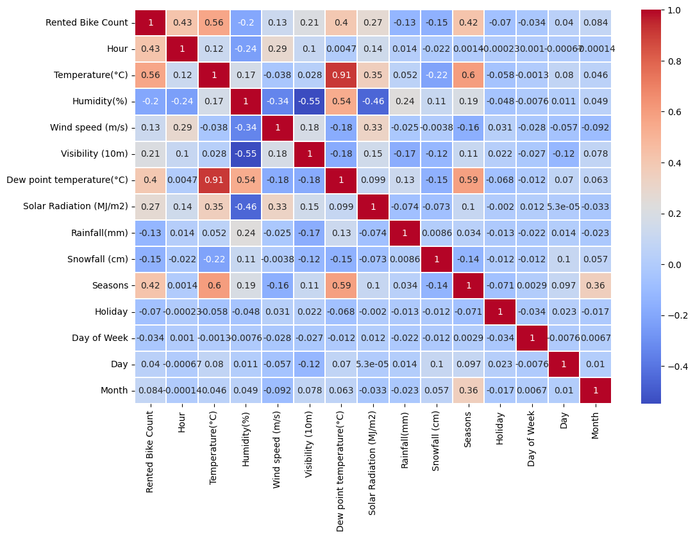
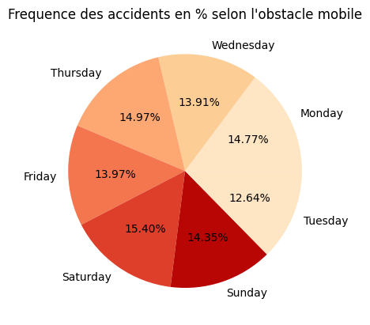
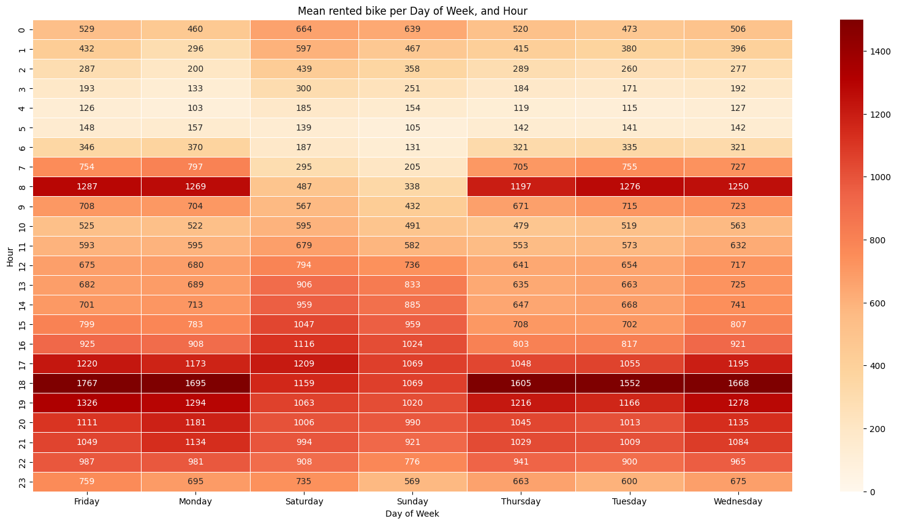
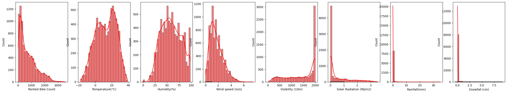

# seoul_bikes_predictions
Machine Learning project using regression model to predict the number of rented bikes per day and per hour.

**Dataset :**
[Link To Dataset](https://archive.ics.uci.edu/dataset/560/seoul+bike+sharing+demand) 
**Initial Dataset :**
- **Date:** year-month-day
- **Rented Bike count:** Count of bikes rented at each hour
- **Hour:** Hour of the day
- **Temperature:** Temperature in Celsius
- **Humidity:** Percentage (%)
- **Windspeed:** Speed in m/s
- **Visibility:** 10m
- **Dew point temperature:** Temperature in Celsius
- **Solar radiation:** MJ/m2
- **Rainfall:** mm
- **Snowfall:** cm
- **Seasons:** Winter, Spring, Summer, Autumn
- **Holiday:** Holiday/No holiday
- **Functional Day:** NoFunc (Non-Functional Hours), Fun (Functional hours)

**Goal :**
In a first part, we trained a regression model to predict Rented Bike Count.
By saving this model, we create a flask api with a form html page, to run the model on inputs features values.
Steps :
- **Cleaning the Data**
- **Normalize the Data**
- **Experimental Training**
- **Hyperparameter's Tuning of LGBMRegressor**
- **Flask API**

## Cleaning & Analyse the Data,
- **No missing values**
- **Convert Categorical Data by Mapping**

**More about Date feature :**
- We created 3 new columns : **Day**, **Month**, **Day of Week**.
- We don't add Year because the dataset starts in 1/12/2017 and ends the 30/11/2018, so in majority, Year is just represented by 2018.
- After this, we dropped Date.

**Quick view of the distribution of each data :**

- In a quick view, we can see that few continuous features are not well distributed, especially Snowfall, Rainfall, Visibility and Solar Radiation.
- For categorical data, None Functioning Day are under represented.

**Distribution of Rented Bike Count in depends of Categorical Features :**

We can see that feature 'Functioning Day' will not be useful because there are 0 counted rented bike when it is not a functioning day.  \\
So, we don't need Functioning Day column, so :
- First, we drop all rows where the day is not a functioning Day.
- After, we drop all the column.

**Correlation :**

We need to drop 'Dew point temperature(°C)' because :
- it is to much correlate with 'Temperature(°C)'
- but 'Temperature(°C)' has a better correlation with 'Rented Bike Count'
Moreover, we added Day of week which have the smaller correlation with Rented Bike Count, but we didn't dropped it, we will see later why.

**Day of Week's Analysis :**
**Frequency of the number of bikes rented depending on the day of the week :**

Day of Week seems to not get an impact on Rented Bike Count. Because each day has the same frequency.

Perhaps, if we combine Day of Week with Hour, We can see interesting behaviors in the average number of bikes rented depending on the day of the week and time of day.

For example, we can see :
- We can see that, for each day, at 18 hour, there are a lot of rented bike. It can be explain by the fact that people go back to work or go out during the weekend .
- At 8 hour, a lot of bikes are rented, except for the weekend. It can be explain by the fact that people go to work at this hour.
- So the Rented Bikes Dataset highlights the behaviors of the inhabitants of seoul
In conclusion, Keeping Day of Week is very interesting, it potentially increases Hour feature importance.

## Normalize the Data
**Visualization of continuous values :**

- 'Rented Bike Count' is not normally distributed.
- 'Wind speed (m/s)' is not normally distributed.
- 'Temperature(°C)' doesn't need transformation.
- 'Humidity(%)' doesn't need transformation.
- We can't apply normalization at 'Visibility (10m)', 'Solar Radiation (Mj/m2)', 'Rainfall(mm)' and 'Snowfall (cm)'.

