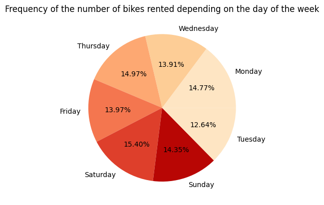
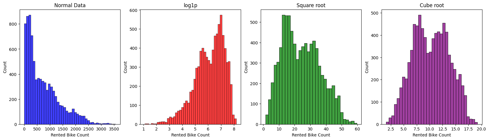
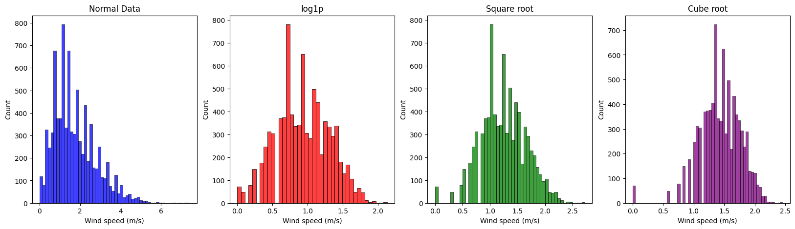
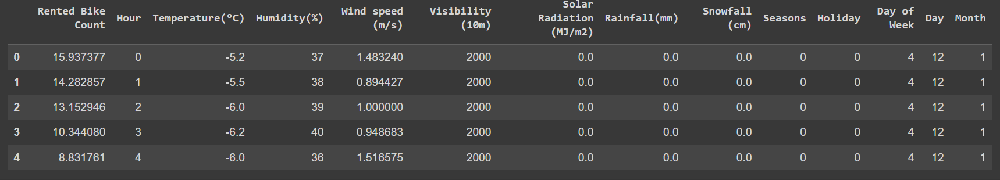
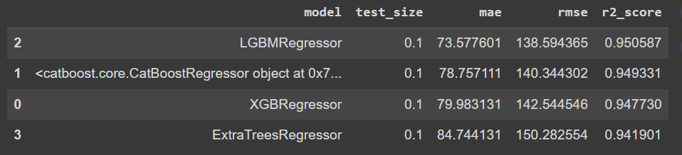
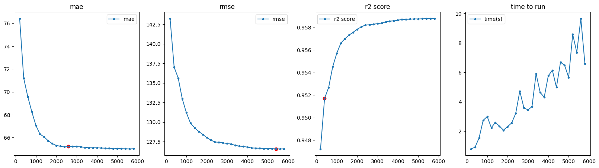

# seoul_bikes_predictions
Machine Learning project using regression model to predict the number of rented bikes per day and per hour.

**Dataset :**
[Link To Dataset](https://archive.ics.uci.edu/dataset/560/seoul+bike+sharing+demand) 
**Initial Dataset :**
- **Date:** year-month-day
- **Rented Bike count:** Count of bikes rented at each hour
- **Hour:** Hour of the day
- **Temperature:** Temperature in Celsius
- **Humidity:** Percentage (%)
- **Windspeed:** Speed in m/s
- **Visibility:** 10m
- **Dew point temperature:** Temperature in Celsius
- **Solar radiation:** MJ/m2
- **Rainfall:** mm
- **Snowfall:** cm
- **Seasons:** Winter, Spring, Summer, Autumn
- **Holiday:** Holiday/No holiday
- **Functional Day:** NoFunc (Non-Functional Hours), Fun (Functional hours)

**Goal :**
In a first part, we trained a regression model to predict Rented Bike Count.
By saving this model, we create a flask api with a form html page, to run the model on inputs features values.
**Steps :**
- **Cleaning  & Analyse the Data**
- **Normalize the Data**
- **Experimental Training**
- **Hyperparameter's Tuning of LGBMRegressor**
- **Flask API**

## Cleaning & Analyse the Data,
- **No missing values**
- **Convert Categorical Data by Mapping**

**More about Date feature :**
- We created 3 new columns : **Day**, **Month**, **Day of Week**.
- We don't add Year because the dataset starts in 1/12/2017 and ends the 30/11/2018, so in majority, Year is just represented by 2018.
- After this, we dropped Date.

**Quick view of the distribution of each data :**

- In a quick view, we can see that few continuous features are not well distributed, especially Snowfall, Rainfall, Visibility and Solar Radiation.
- For categorical data, None Functioning Day are under represented.

**Distribution of Rented Bike Count in depends of Categorical Features :**

We can see that feature 'Functioning Day' will not be useful because there are 0 counted rented bike when it is not a functioning day.  \\
So, we don't need Functioning Day column, so :
- First, we drop all rows where the day is not a functioning Day.
- After, we drop all the column.

**Correlation :**

We need to drop 'Dew point temperature(°C)' because :
- it is to much correlate with 'Temperature(°C)'
- but 'Temperature(°C)' has a better correlation with 'Rented Bike Count'
Moreover, we added Day of week which have the smaller correlation with Rented Bike Count, but we didn't dropped it, we will see later why.

**Day of Week's Analysis :**
**Frequency of the number of bikes rented depending on the day of the week :**

Day of Week seems to not get an impact on Rented Bike Count. Because each day has the same frequency.

Perhaps, if we combine Day of Week with Hour, We can see interesting behaviors in the average number of bikes rented depending on the day of the week and time of day.

For example, we can see :
- We can see that, for each day, at 18 hour, there are a lot of rented bike. It can be explain by the fact that people go back to work or go out during the weekend .
- At 8 hour, a lot of bikes are rented, except for the weekend. It can be explain by the fact that people go to work at this hour.
- So the Rented Bikes Dataset highlights the behaviors of the inhabitants of seoul
In conclusion, Keeping Day of Week is very interesting, it potentially increases Hour feature importance.

## Normalize the Data
**Visualization of continuous values :**

- 'Rented Bike Count' is not normally distributed.
- 'Wind speed (m/s)' is not normally distributed.
- 'Temperature(°C)' doesn't need transformation.
- 'Humidity(%)' doesn't need transformation.
- We can't apply normalization at 'Visibility (10m)', 'Solar Radiation (Mj/m2)', 'Rainfall(mm)' and 'Snowfall (cm)'.
  
**Normalization methods on Rented Bike COunt :**

We applied square root on it.

**Normalization methods on Wind Speed :**

We applied square root on it.

## Sample of Final Dataset

## Experimental Training
We tried several models on our dataset with different test size :
- models : ** **
- test_sizes : **[0.1, 0.2]**

We use three metrics to determine model performance.

### Mean Absolute Error (MAE)
The Mean Absolute Error measures the average of the absolute errors between predictions and actual values. It is simply the average of the absolute difference between each prediction and the real value. The formula for MAE is:

`MAE = 1/n * Σ|y_i - ŷ_i|`

where `y_i` is the actual value and `ŷ_i` is the predicted value. MAE gives an idea of the magnitude of errors in the predictions, ignoring their direction (positive or negative). A lower MAE indicates better model performance.

### Root Mean Squared Error (RMSE)
RMSE is similar to MAE but gives more weight to larger errors as it squares the errors before averaging and then takes the square root of the average to obtain RMSE. The formula for RMSE is:

`RMSE = sqrt(1/n * Σ(y_i - ŷ_i)²)`

RMSE is useful when larger errors are particularly undesirable. A lower RMSE value indicates better model performance.

### R² Score (Coefficient of Determination)
The R² score measures the proportion of the variance in the dependent variable that is predictable from the independent variables in the model. The formula for R² is:

`R² = 1 - (Σ(y_i - ŷ_i)² / Σ(y_i - ȳ)²)`

where `ȳ` is the average of the actual values. The R² score is a measure of how well a model fits the data. A score of 1 indicates a perfect fit, while a score of 0 would mean the model is no better than simply predicting the mean of the dependent variable for all observations.

  

The best model by looking at metrics is LGMBRegressor.

### 1. LGBMRegressor
**LightGBM (Light Gradient Boosting Machine)** is a gradient boosting framework that uses tree-based learning algorithms. It's designed for distributed and efficient training, particularly on large datasets. LGBMRegressor is used for regression tasks and is known for its high performance and speed.

## Hyperparameter's Tuning of LGBMRegressor**
We runned a grid search for hyperparameters of LGBMRegressor.
**First to gain time complexity, we found a good n_estimator :**
- This parameter defines the number of trees (or base learners) to be built in the ensemble.
- In Gradient Boosting algorithms, such as LightGBM, trees are built sequentially. Each tree corrects the errors made by the previous ones. The final prediction is the sum of the predictions from all trees. Increasing n_estimators in gradient boosting typically improves the model's performance, but it may also increase the risk of overfitting. \\
So more we increase it, more our model is efficient. Perhaps, it will also increase time complexity.
- So, in this part, we will try to chose a good n_estimators between 200 and 6000 based on when the mae, rmse and r2 score don't change a lot when we increase it.
- 

We decided to keep n_estimator=3000, because after we don't gain a lot of accuracy.
